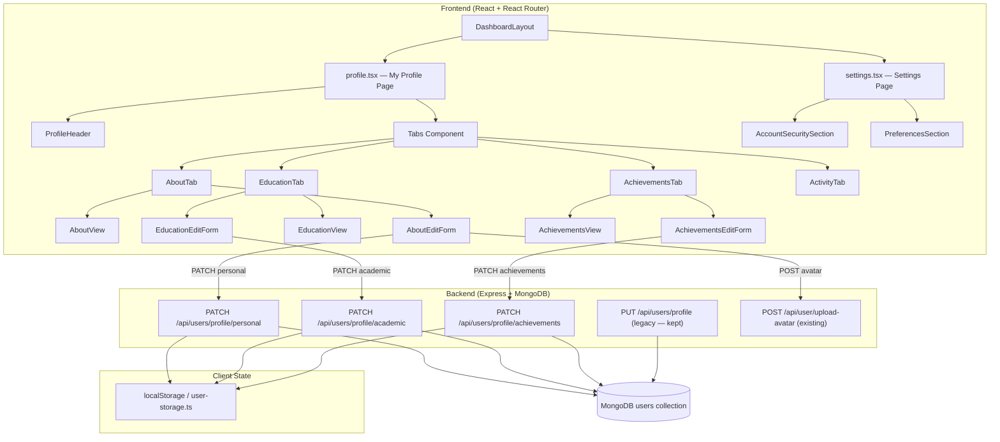
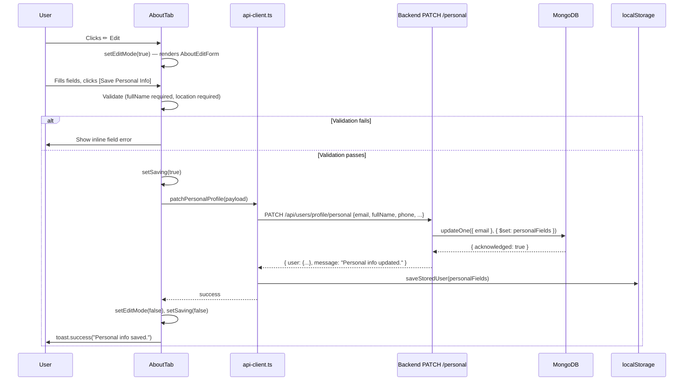
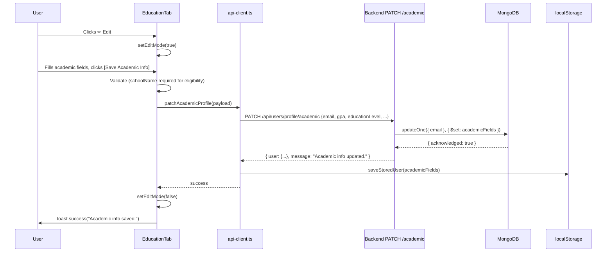
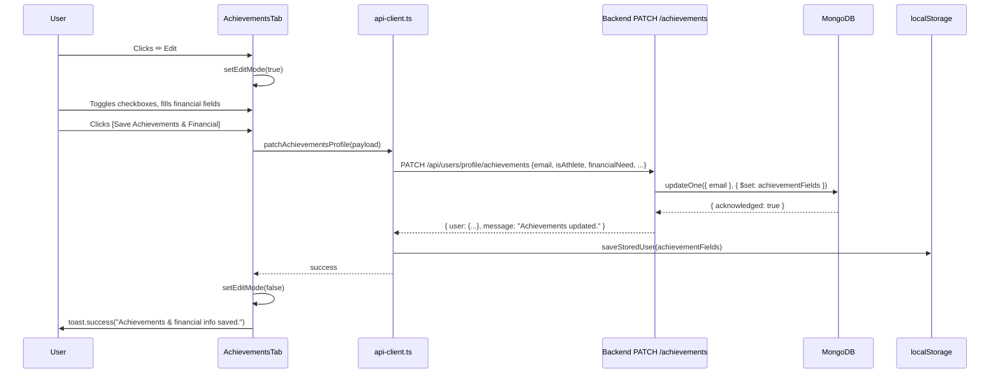

# Design Document: Profile Settings Restructure

## Overview

The SCHOLAR system currently conflates profile editing with account settings — all profile fields (personal info, academic details, financial data, special categories) live inside `settings.tsx`, while `profile.tsx` is a read-only view. This restructure moves all profile-editing capability directly into the My Profile page as inline, tab-scoped edit forms, and strips Settings down to only account security and preferences. The result is a cleaner mental model: **Profile = who you are**, **Settings = how the app behaves for you**.

The change also introduces three section-specific PATCH endpoints on the backend so each tab can save independently without touching unrelated fields, and removes the `💚` emoji from the Indigent eligibility badge to keep the UI professional.

---

## Architecture

### High-Level Component Topology



### Page Responsibility Split (After Restructure)

| Concern | My Profile (`profile.tsx`) | Settings (`settings.tsx`) |
|---|---|---|
| Full Name, Phone, Location, Bio, Skills, Avatar | ✅ Edit (About tab) | ❌ Removed |
| GPA, Education Level, Year Level, Field of Study, Graduation Year, School Info, Academic Honors | ✅ Edit (Education tab) | ❌ Removed |
| Special Categories, Financial Need, Net Worth, Income Category | ✅ Edit (Achievements tab) | ❌ Removed |
| Password, 2FA, Email Notifications, Privacy | ❌ View only (header badges) | ✅ Kept |
| Language, Theme | ❌ | ✅ Kept |

---

## Sequence Diagrams

### Save Personal Info (About Tab)



### Save Academic Info (Education Tab)



### Save Achievements & Financial (Achievements Tab)



---

## Components and Interfaces

### ProfileHeader

**Purpose**: Displays avatar, name, headline, location, email, join date, eligibility badges. Hosts the primary [✏ Edit Profile] button that activates About tab edit mode.

**Interface**:
```typescript
interface ProfileHeaderProps {
  user: StoredUser | null;
  onEditProfile: () => void;   // triggers About tab edit mode
}
```

**Responsibilities**:
- Render cover photo, avatar, name, headline, meta info
- Render eligibility badges (without emoji on Indigent badge)
- Render [✏ Edit Profile] outlined button that calls `onEditProfile`
- Replace the existing "Edit Profile" button that navigated to `/dashboard/settings`

---

### AboutTab

**Purpose**: Renders bio + skills in view mode; switches to a full personal-info form in edit mode.

**Interface**:
```typescript
interface AboutTabProps {
  user: StoredUser | null;
  editMode: boolean;
  onEditToggle: () => void;
  onSaveSuccess: (updatedFields: Partial<StoredUser>) => void;
}
```

**View Mode renders**:
- Bio text (or "No bio added yet." placeholder)
- Skills as `<Badge variant="secondary">` chips

**Edit Mode renders** (`AboutEditForm`):
- Full Name (required, text input)
- Phone Number (optional, text input)
- Location (required, text input, default "Quezon City")
- Date of Birth (date picker, `<input type="date">`)
- Bio / Headline (textarea)
- Skills (comma-separated text input)
- Profile Picture (file input, JPG/PNG, max 5 MB — calls existing `uploadUserAvatar`)
- [Save Personal Info] (blue, calls `patchPersonalProfile`)
- [Cancel] (gray, resets form and exits edit mode)

---

### EducationTab

**Purpose**: Renders school/academic summary cards in view mode; switches to academic edit form in edit mode.

**Interface**:
```typescript
interface EducationTabProps {
  user: StoredUser | null;
  editMode: boolean;
  onEditToggle: () => void;
  onSaveSuccess: (updatedFields: Partial<StoredUser>) => void;
}
```

**View Mode renders**:
- School name + campus, school type badge, school location badge (green for QC, yellow otherwise)
- Education level, year level, field of study, graduation year
- GPA with descriptive label (Excellent / Good / Satisfactory / Passing / Failing)
- Academic honors badge if `hasAcademicHonors === true`

**Edit Mode renders** (`EducationEditForm`):
- GPA (number input, 1.00–5.00, Philippine scale)
- Education Level (Select dropdown)
- Year Level (Select dropdown, dynamic options based on Education Level)
- Field of Study (text input)
- Graduation Year (number input)
- School / Institution Name (required text input)
- Campus / Branch (optional text input)
- School Type (Select dropdown)
- School Location (Select dropdown — Quezon City auto-verified)
- Graduated with academic honors (checkbox)
- Class Rank (Select dropdown, shown when honors checkbox is checked)
- [Save Academic Info] (blue, calls `patchAcademicProfile`)
- [Cancel] (gray)

---

### AchievementsTab

**Purpose**: Renders special category badges and financial info in view mode; switches to achievements/financial edit form in edit mode.

**Interface**:
```typescript
interface AchievementsTabProps {
  user: StoredUser | null;
  editMode: boolean;
  onEditToggle: () => void;
  onSaveSuccess: (updatedFields: Partial<StoredUser>) => void;
}
```

**View Mode renders**:
- Only checked special categories as `<Badge>` chips (no unchecked items shown)
- Financial info (income category, financial need rating) — visible only to the student themselves (always true in this single-user view)
- Placeholder if no categories are set

**Edit Mode renders** (`AchievementsEditForm`):
- Special Categories checkboxes (two-column grid):
  - Left: Athlete, SK Official / Youth Leader, From Indigent / Low-income Family, Solo Parent
  - Right: Artist, Student Council / Government Leader, Person with Disability (PWD)
- Financial Need (number input 1–5 or slider)
- Net Worth (optional, ₱ prefix text input)
- Currency (Select dropdown, default PHP)
- Income Category (Select dropdown)
- [Save Achievements & Financial] (blue, calls `patchAchievementsProfile`)
- [Cancel] (gray)

---

### AccountSecuritySection (Settings)

**Purpose**: Renders the four security action rows after the profile fields are removed.

**Interface**:
```typescript
interface AccountSecuritySectionProps {
  user: StoredUser | null;
  onPasswordChange: () => void;
  onNotificationConfigure: () => void;
  onPrivacyManage: () => void;
}
```

**Renders**:
- Email Notifications → [Configure] (opens existing dialog)
- Privacy Settings → [Manage] (opens existing dialog)
- Password → [Update] (opens existing dialog)
- Two-Factor Authentication → [Configure] (placeholder or existing flow)

---

### PreferencesSection (Settings)

**Purpose**: Language and theme selectors — unchanged from current implementation.

**Interface**:
```typescript
interface PreferencesSectionProps {
  language: string;
  theme: string;
  onSave: (language: string, theme: string) => void;
}
```

---

## Data Models

### PersonalProfilePayload

Fields sent to `PATCH /api/users/profile/personal`:

```typescript
interface PersonalProfilePayload {
  email: string;           // required — identifies the user
  fullName?: string;
  phone?: string;
  location?: string;
  dateOfBirth?: string;    // ISO date string "YYYY-MM-DD"
  about?: string;          // bio text
  headline?: string;
  skills?: string[];
  // profileImage handled separately via POST /api/user/upload-avatar
}
```

**Validation Rules**:
- `email` must be a non-empty, valid email string
- `fullName` must be non-empty when provided
- `location` must be non-empty when provided
- `skills` array items must be non-empty strings after trim

---

### AcademicProfilePayload

Fields sent to `PATCH /api/users/profile/academic`:

```typescript
interface AcademicProfilePayload {
  email: string;
  gpa?: string;                  // "1.00"–"5.00" Philippine scale
  educationLevel?: string;       // enum: Junior High School | Senior High School | College/Undergraduate | Vocational/TESDA | Postgraduate
  yearLevel?: string;            // dynamic based on educationLevel
  fieldOfStudy?: string;
  graduationYear?: string;
  schoolName?: string;           // required for eligibility
  schoolCampus?: string;
  schoolType?: string;           // enum: Public University | Private University | ...
  schoolLocation?: string;       // enum: Quezon City | Outside QC | Outside MM
  enrolledInQCSchool?: boolean;  // derived: schoolLocation === "Quezon City"
  hasAcademicHonors?: boolean;
  academic_rank?: string;        // "Rank 1"–"Rank 10" | "Top 10%" | "Top 25%"
}
```

**Validation Rules**:
- `gpa` when provided: numeric string, 1.00 ≤ value ≤ 5.00
- `yearLevel` options must be valid for the selected `educationLevel`
- `graduationYear` when provided: 4-digit year, ≥ current year − 10

---

### AchievementsProfilePayload

Fields sent to `PATCH /api/users/profile/achievements`:

```typescript
interface AchievementsProfilePayload {
  email: string;
  isAthlete?: boolean;
  isArtist?: boolean;
  isSKOfficial?: boolean;
  isStudentLeader?: boolean;
  isIndigent?: boolean;
  isPWD?: boolean;
  isSoloParent?: boolean;
  financialNeed?: number;        // 1–5
  netWorth?: string;
  currency?: string;             // default "PHP"
  incomeCategory?: string;       // enum: Under ₱25,000 | ₱25,000–₱50,000 | ₱50,000–₱100,000 | ₱100,000+
}
```

**Validation Rules**:
- `financialNeed` when provided: integer 1–5
- `currency` when provided: non-empty string (ISO 4217 recommended)

---

### EligibilityBadge Display Rules

```typescript
// Indigent badge — NO emoji
user?.isIndigent ? "Indigent/Low-income" : null

// Other special category badges — audit for out-of-place emojis
// Keep: ♿ PWD (accessibility symbol, appropriate)
// Keep: 🏃 Athlete, 🎨 Artist, 🌟 SK Official, 📢 Student Leader, 👨‍👩‍👧 Solo Parent
// Remove: 💚 from Indigent (was the only out-of-place one)
```

---

## API Route Design

### New Routes (Backend `index.js`)

#### `PATCH /api/users/profile/personal`

```
Request body: PersonalProfilePayload
Auth: email-based lookup (consistent with existing PUT /api/users/profile)
Response 200: { user: { ...updatedFields }, message: "Personal info updated." }
Response 400: { error: "email is required." }
Response 404: { error: "User not found." }
Response 500: { error: "Failed to update personal info." }
```

MongoDB operation:
```javascript
db.collection("users").updateOne(
  { email: normalizedEmail },
  { $set: { fullName, phone, location, dateOfBirth, about, headline, skills } }
)
```

#### `PATCH /api/users/profile/academic`

```
Request body: AcademicProfilePayload
Response 200: { user: { ...updatedFields }, message: "Academic info updated." }
Response 400: { error: "email is required." } | { error: "GPA must be between 1.00 and 5.00." }
Response 404: { error: "User not found." }
```

MongoDB operation:
```javascript
db.collection("users").updateOne(
  { email: normalizedEmail },
  { $set: { gpa, educationLevel, yearLevel, fieldOfStudy, graduationYear,
            schoolName, schoolCampus, schoolType, schoolLocation,
            enrolledInQCSchool, hasAcademicHonors, academic_rank } }
)
```

#### `PATCH /api/users/profile/achievements`

```
Request body: AchievementsProfilePayload
Response 200: { user: { ...updatedFields }, message: "Achievements updated." }
Response 400: { error: "financialNeed must be between 1 and 5." }
Response 404: { error: "User not found." }
```

MongoDB operation:
```javascript
db.collection("users").updateOne(
  { email: normalizedEmail },
  { $set: { isAthlete, isArtist, isSKOfficial, isStudentLeader,
            isIndigent, isPWD, isSoloParent,
            financialNeed, netWorth, currency, incomeCategory } }
)
```

### New `api-client.ts` Functions

```typescript
export function patchPersonalProfile(payload: PersonalProfilePayload) {
  return request<{ user: Record<string, unknown>; message: string }>(
    "/api/users/profile/personal",
    { method: "PATCH", body: JSON.stringify(payload) }
  );
}

export function patchAcademicProfile(payload: AcademicProfilePayload) {
  return request<{ user: Record<string, unknown>; message: string }>(
    "/api/users/profile/academic",
    { method: "PATCH", body: JSON.stringify(payload) }
  );
}

export function patchAchievementsProfile(payload: AchievementsProfilePayload) {
  return request<{ user: Record<string, unknown>; message: string }>(
    "/api/users/profile/achievements",
    { method: "PATCH", body: JSON.stringify(payload) }
  );
}
```

---

## State Management Design

### Edit Mode State in `profile.tsx`

Each tab manages its own independent edit mode. The parent `Profile` component holds the active tab and a shared `activeEditTab` signal so the [✏ Edit Profile] header button can activate the About tab's edit mode.

```typescript
// In Profile component
const [activeTab, setActiveTab] = useState<"about" | "education" | "achievements" | "activity">("about");
const [aboutEditMode, setAboutEditMode] = useState(false);
const [educationEditMode, setEducationEditMode] = useState(false);
const [achievementsEditMode, setAchievementsEditMode] = useState(false);

// Local user state — updated optimistically on save success
const [localUser, setLocalUser] = useState<StoredUser | null>(getStoredUser());

const handleEditProfile = () => {
  setActiveTab("about");
  setAboutEditMode(true);
};

const handleSaveSuccess = (updatedFields: Partial<StoredUser>) => {
  const merged = { ...localUser, ...updatedFields } as StoredUser;
  setLocalUser(merged);
  saveStoredUser(updatedFields);
};
```

### Edit Form Local State Pattern (per tab)

Each edit form component manages its own draft state, initialized from `user` prop. On cancel, draft state is reset to `user` prop values. On save success, the parent's `onSaveSuccess` is called with the saved fields.

```typescript
// Example: AboutEditForm internal state
const [draftFullName, setDraftFullName] = useState(user?.fullName ?? "");
const [draftPhone, setDraftPhone] = useState(user?.phone ?? "");
const [draftLocation, setDraftLocation] = useState(user?.location ?? "Quezon City");
const [draftBio, setDraftBio] = useState(user?.about ?? "");
const [draftSkills, setDraftSkills] = useState((user?.skills ?? []).join(", "));
const [draftDob, setDraftDob] = useState(user?.dateOfBirth ?? "");
const [saving, setSaving] = useState(false);

const handleCancel = () => {
  // Reset all draft state to user prop values
  setDraftFullName(user?.fullName ?? "");
  // ... reset others
  onEditToggle(); // exits edit mode
};
```

### Tab Edit Button Placement

Each `TabsContent` panel gets a small [✏ Edit] icon button in its top-right corner:

```typescript
<TabsContent value="about">
  <div className="flex items-center justify-between mb-4">
    <h2 className="text-lg font-semibold">About</h2>
    {!editMode && (
      <Button variant="outline" size="sm" onClick={onEditToggle}>
        <Pencil className="h-4 w-4 mr-1" /> Edit
      </Button>
    )}
  </div>
  {editMode ? <AboutEditForm ... /> : <AboutView ... />}
</TabsContent>
```

---

## Error Handling

### Scenario 1: Network / Server Error on Save

**Condition**: `patchPersonalProfile` / `patchAcademicProfile` / `patchAchievementsProfile` throws (network failure or 5xx).

**Response**: `toast.error("Failed to save. Your changes were not saved — please try again.")`. Form remains in edit mode with draft values intact. `setSaving(false)` is called in `finally`.

**Recovery**: User can retry or cancel.

---

### Scenario 2: Validation Error (Client-Side)

**Condition**: Required field is empty (e.g., Full Name blank, School Name blank).

**Response**: Inline error message below the field (`<p className="text-sm text-red-500">...</p>`). Save button remains enabled but submission is blocked until corrected.

**Recovery**: User fills in the required field.

---

### Scenario 3: GPA Out of Range

**Condition**: User enters a GPA value outside 1.00–5.00.

**Response**: On blur, clamp to nearest valid value (same behavior as current `settings.tsx`). Show helper text "Philippine GPA scale: 1.00 = Highest, 5.00 = Failing."

**Recovery**: Automatic clamping on blur.

---

### Scenario 4: Avatar Upload Failure

**Condition**: `uploadUserAvatar` throws (file too large, wrong type, server error).

**Response**: `toast.error(err.message)`. Profile image state reverts to previous value. Other form fields are unaffected.

**Recovery**: User selects a different file or retries.

---

### Scenario 5: User Not Found (404 from Backend)

**Condition**: Backend returns 404 (stale session, deleted account).

**Response**: `toast.error("Session expired. Please sign in again.")`. Redirect to `/auth/signin`.

**Recovery**: User re-authenticates.

---

### Scenario 6: Concurrent Edit Conflict

**Condition**: User opens profile in two tabs and saves from both.

**Response**: Last write wins (MongoDB `updateOne` with `$set` is idempotent per field). No special conflict UI needed at this stage.

---

## Testing Strategy

### Unit Testing Approach

Test each edit form component in isolation using React Testing Library:
- Renders in view mode by default
- Clicking [✏ Edit] switches to edit mode
- Clicking [Cancel] resets draft state and returns to view mode
- Required field validation prevents submission
- `onSaveSuccess` is called with correct payload on successful save
- GPA clamping logic: values < 1.00 clamp to 1.00, values > 5.00 clamp to 5.00

### Property-Based Testing Approach

**Property Test Library**: fast-check

Key properties to verify:

1. **GPA clamping is idempotent**: For any GPA string input, applying the clamp function twice produces the same result as applying it once.
   ```
   ∀ gpaInput: string → clamp(clamp(gpaInput)) === clamp(gpaInput)
   ```

2. **Skills round-trip**: For any array of non-empty skill strings, splitting the joined string by comma and trimming produces the original array.
   ```
   ∀ skills: string[] (non-empty items) →
     skills.join(", ").split(",").map(s => s.trim()).filter(Boolean) deep-equals skills
   ```

3. **Edit mode toggle is a boolean flip**: Calling `onEditToggle` always inverts the current `editMode` boolean.
   ```
   ∀ editMode: boolean → toggle(toggle(editMode)) === editMode
   ```

4. **Section-specific PATCH does not mutate unrelated fields**: After `patchPersonalProfile`, the academic and achievements fields in the stored user remain unchanged.
   ```
   ∀ personalPayload → storedUser.gpa === storedUser_before.gpa
                     ∧ storedUser.isAthlete === storedUser_before.isAthlete
   ```

5. **Eligibility badge list contains no null/undefined entries**: For any user object, the `eligibilityBadges` array after `.filter(Boolean)` contains only non-empty strings.
   ```
   ∀ user: StoredUser → eligibilityBadges(user).every(b => typeof b === "string" && b.length > 0)
   ```

6. **Indigent badge contains no emoji**: For any user with `isIndigent === true`, the badge string does not contain any Unicode emoji character.
   ```
   ∀ user where user.isIndigent === true →
     indigentBadge(user).match(/\p{Emoji}/u) === null
   ```

### Integration Testing Approach

- `PATCH /api/users/profile/personal` with valid payload updates only personal fields in MongoDB
- `PATCH /api/users/profile/academic` with `schoolLocation: "Quezon City"` sets `enrolledInQCSchool: true`
- `PATCH /api/users/profile/achievements` with `financialNeed: 6` returns 400
- Legacy `PUT /api/users/profile` still accepts all fields and returns 200 (backward compatibility)
- Avatar upload via `POST /api/user/upload-avatar` still works and updates `profileImage` in MongoDB

---

## Performance Considerations

- Each tab's edit form is only mounted when edit mode is active (conditional rendering), keeping the initial profile page render lightweight.
- Avatar upload uses the existing multer endpoint with a 5 MB limit (frontend enforces this before upload).
- The three PATCH endpoints use `$set` with only the relevant fields, avoiding full document replacement and reducing write amplification.
- `localUser` state in `Profile` is updated optimistically on save success, so the view mode reflects changes immediately without a re-fetch.

---

## Security Considerations

- All three PATCH endpoints identify the user by `email` from the request body, consistent with the existing `PUT /api/users/profile` pattern. When JWT middleware is fully enforced, the email should be extracted from `req.userId` / token claims rather than the body to prevent spoofing.
- Financial information (income category, financial need, net worth) is rendered in the Achievements tab view mode with a note that it is private and visible only to the student. No additional server-side visibility filter is needed for the MVP since the profile page is student-scoped.
- Avatar file type and size validation is enforced on both client (file input `accept` attribute + size check) and server (multer `fileFilter` + `limits`).
- The `enrolledInQCSchool` boolean is derived server-side from `schoolLocation === "Quezon City"` to prevent client-side spoofing of QC residency eligibility.

---

## Correctness Properties

*A property is a characteristic or behavior that should hold true across all valid executions of a system — essentially, a formal statement about what the system should do. Properties serve as the bridge between human-readable specifications and machine-verifiable correctness guarantees.*

These properties express universal invariants that must hold across all valid inputs and states. They directly inform the property-based tests described in the Testing Strategy section.

### Property 1: GPA Clamping Idempotence

For any string input `s`, applying the GPA clamp function twice yields the same result as applying it once:

`∀ s: string → clamp(clamp(s)) = clamp(s)`

**Validates: Requirements 3.4**

### Property 2: Skills Round-Trip Fidelity

For any array of non-empty, trimmed skill strings, serialising to a comma-separated string and deserialising back produces the original array:

`∀ skills: string[] where ∀ s ∈ skills, s.trim() = s ∧ s ≠ "" →`
`  skills.join(", ").split(",").map(s => s.trim()).filter(Boolean) deep-equals skills`

**Validates: Requirements 2.3**

### Property 3: Edit Mode Toggle Involution

Toggling edit mode twice always returns to the original state:

`∀ editMode: boolean → toggle(toggle(editMode)) = editMode`

**Validates: Requirements 7.2**

### Property 4: Section-Specific PATCH Field Isolation

After a successful `patchPersonalProfile` call, all academic and achievements fields in the stored user remain identical to their pre-save values:

`∀ personalPayload, storedUser_before →`
`  storedUser_after.gpa = storedUser_before.gpa`
`  ∧ storedUser_after.educationLevel = storedUser_before.educationLevel`
`  ∧ storedUser_after.isAthlete = storedUser_before.isAthlete`
`  ∧ storedUser_after.financialNeed = storedUser_before.financialNeed`

**Validates: Requirements 5.1, 5.2, 5.3, 5.10**

### Property 5: Eligibility Badge List Is Non-Null

For any user object, the computed eligibility badge array contains only non-empty strings after filtering:

`∀ user: StoredUser → eligibilityBadges(user).every(b => typeof b = "string" ∧ b.length > 0)`

**Validates: Requirements 6.1**

### Property 6: Indigent Badge Is Emoji-Free

For any user where `isIndigent = true`, the resulting badge string contains no Unicode emoji characters:

`∀ user where user.isIndigent = true → indigentBadge(user) matches /\p{Emoji}/u = false`

**Validates: Requirements 6.2**

### Property 7: QC School Derivation Consistency

The `enrolledInQCSchool` flag is always the logical equivalence of `schoolLocation = "Quezon City"`, regardless of any client-supplied value:

`∀ payload: AcademicProfilePayload →`
`  storedEnrolledInQCSchool = (payload.schoolLocation = "Quezon City")`

**Validates: Requirements 5.4**

### Property 8: Financial Need Range Invariant

Any `financialNeed` value accepted by the backend is an integer in [1, 5]; any value outside this range is rejected with HTTP 400:

`∀ n: financialNeed accepted by PATCH /achievements → 1 ≤ n ≤ 5 ∧ n ∈ ℤ`

**Validates: Requirements 5.8**

### Property 9: Year Level Validity Relative to Education Level

For any saved academic profile, the `yearLevel` value is a member of the valid options for the given `educationLevel`:

`∀ profile: AcademicProfilePayload where profile.yearLevel ≠ null →`
`  profile.yearLevel ∈ yearLevelOptions[profile.educationLevel]`

**Validates: Requirements 3.3**

### Property 10: Settings Page Contains No Profile Fields Post-Restructure

After the restructure, the Settings page component renders no form fields for GPA, educationLevel, yearLevel, fieldOfStudy, graduationYear, schoolName, schoolType, schoolLocation, financialNeed, netWorth, incomeCategory, or specialCategories:

`∀ rendered output of Settings → profileFieldIds ∩ renderedInputIds = ∅`

**Validates: Requirements 1.1**

### Property 11: Cancel Restores Draft State to StoredUser Values

For any tab edit form and any StoredUser, clicking Cancel always resets every draft field to the corresponding value from StoredUser and deactivates Edit_Mode:

`∀ tab ∈ {About_Tab, Education_Tab, Achievements_Tab}, ∀ user: StoredUser →`
`  after cancel: draftState(tab) deep-equals relevantFields(user) ∧ editMode(tab) = false`

**Validates: Requirements 2.4, 3.8, 4.6**

### Property 12: Successful Save Updates StoredUser Optimistically

For any valid save payload submitted from any tab, after a successful PATCH response the localUser state and StoredUser contain the saved fields without requiring a server re-fetch:

`∀ tab ∈ {About_Tab, Education_Tab, Achievements_Tab}, ∀ validPayload →`
`  after successful save: localUser contains all fields from validPayload`

**Validates: Requirements 2.5, 3.5, 4.3, 7.3**

### Property 13: Independent Tab Edit Mode Isolation

Activating or deactivating Edit_Mode for any one tab never changes the Edit_Mode state of any other tab:

`∀ tab_A, tab_B ∈ {About_Tab, Education_Tab, Achievements_Tab} where tab_A ≠ tab_B →`
`  toggle(editMode(tab_A)) does not affect editMode(tab_B)`

**Validates: Requirements 7.1**

### Property 14: Draft State Preserved Across Tab Navigation

For any tab with active Edit_Mode and any non-empty draft state, navigating to a different tab and returning preserves the draft state exactly:

`∀ tab: Tab, ∀ draftState: DraftState →`
`  navigate_away(tab) then navigate_back(tab) → draftState(tab) unchanged`

**Validates: Requirements 7.4**

### Property 15: Invalid File Rejection Does Not Corrupt Draft State

For any About_Tab draft state and any file that exceeds 5 MB or has an unsupported MIME type, rejecting the file leaves all other draft fields unchanged:

`∀ draftState: AboutDraftState, ∀ invalidFile: File →`
`  after rejection: draftState fields excluding profileImage are unchanged`

**Validates: Requirements 2.8**

### Property 16: GPA Out-of-Range Rejection by Backend

For any GPA value outside the range [1.00, 5.00], the Academic_PATCH_Endpoint returns HTTP 400 and does not modify the database:

`∀ gpa: string where parseFloat(gpa) < 1.00 ∨ parseFloat(gpa) > 5.00 →`
`  Academic_PATCH_Endpoint returns 400 ∧ MongoDB document unchanged`

**Validates: Requirements 5.7**

---

## Dependencies

| Dependency | Already Present | Notes |
|---|---|---|
| `react-router` | ✅ | Navigation, `useNavigate` |
| `sonner` | ✅ | Toast notifications |
| `lucide-react` | ✅ | `Pencil`, `Edit` icons for edit buttons |
| `@radix-ui` (via shadcn/ui) | ✅ | Tabs, Select, Dialog, Checkbox, Badge, Button, Input, Textarea, Avatar |
| `fast-check` | ❌ New | Property-based testing — add as dev dependency |
| `multer` (backend) | ✅ | Avatar upload already configured |
| `mongodb` (backend) | ✅ | Raw driver used for `updateOne` |

No new runtime dependencies are required. `fast-check` is the only new addition, as a dev dependency for property-based tests.
