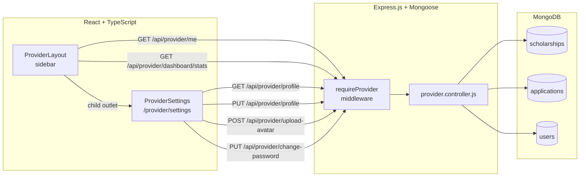

# Design Document

## Feature: Provider Panel Enhancements

---

## Overview

This feature addresses two categories of work in the QCYDO scholarship provider panel:

1. **Data correctness fixes** — the existing `GET /api/provider/scholarships` and `GET /api/provider/dashboard/stats` endpoints filter by `createdBy: providerId`, which returns zero results for the 12 seeded QCYDO scholarships (seeded without that field). Removing those filters makes the pages show real data.

2. **Provider Settings page** — a new `/provider/settings` route backed by four new API endpoints (`GET /api/provider/me`, `GET/PUT /api/provider/profile`, `POST /api/provider/upload-avatar`, `PUT /api/provider/change-password`) and a new React page with three sections: Profile Information, Account Security, and About/Description.

The changes touch the backend Express/Mongoose layer and the React/TypeScript frontend. All new backend routes follow the existing pattern: controller functions in `provider.controller.js`, registered directly in `index.js` under the `requireProvider` middleware guard.

---

## Architecture



The backend is a single Express app (`Backend/index.js`) — there is no separate router file for provider routes. All provider endpoints are registered inline in `index.js` exactly as the existing provider scholarship routes are. Controller functions are exported from `Backend/controller/provider.controller.js`.

The frontend follows the existing React Router v7 pattern: a new `{ path: "settings", Component: ProviderSettings }` child is added under the `provider` path in `routes.tsx`, so it renders inside `ProviderLayout`'s `<Outlet />`.

---

## Components and Interfaces

### Backend: New Controller Functions

All new functions are added to `Backend/controller/provider.controller.js` and registered in `Backend/index.js`.

#### `getProviderMe` — `GET /api/provider/me`

Returns live provider identity from the database. Used by `ProviderLayout` to render the sidebar header.

```js
// Response shape
{
  success: true,
  data: {
    name: string | null,          // user.userName or user.fullName
    email: string,
    organizationName: string | null,  // user.providerDetails.organizationName
    profilePicture: string | null     // user.profilePicture
  }
}
```

`req.provider` is already the full user document, attached by `requireProvider`. This handler simply maps fields and returns them.

#### `getProviderProfileHandler` — `GET /api/provider/profile`

Returns the full provider profile for the settings page.

```js
// Response shape
{
  success: true,
  data: {
    name: string | null,
    email: string,
    organizationName: string | null,
    position: string | null,
    phone: string | null,           // providerDetails.phone (new field)
    officeAddress: string | null,   // providerDetails.officeAddress (new field)
    description: string | null,     // providerDetails.description (new field)
    website: string | null,         // providerDetails.website (new field)
    profilePicture: string | null
  }
}
```

#### `updateProviderProfile` — `PUT /api/provider/profile`

Validates and persists allowed profile fields. Applies a partial update (`$set`) so absent fields are not overwritten.

Allowed body fields: `name`, `organizationName`, `position`, `phone`, `officeAddress`, `description`, `website`.

Validation rules:
- `name` if present: trim, reject if empty/whitespace → HTTP 400.
- `organizationName` if present: trim, reject if empty/whitespace → HTTP 400.
- `website` if present: must start with `http://` or `https://` → HTTP 400.

On success, returns the full updated profile in the same shape as `GET /api/provider/profile`.

#### `uploadProviderAvatar` — `POST /api/provider/upload-avatar`

Uses a dedicated `multer` instance (`providerAvatarUpload`) configured for:
- Destination: `uploads/providers/`
- File size limit: 5 MB
- Allowed MIME types: `image/jpeg`, `image/jpg`, `image/png`
- Filename: `{providerId}-{timestamp}{ext}`

On success, sets `user.profilePicture = /uploads/providers/{filename}` via `User.findByIdAndUpdate`. If the DB write fails after the file is already on disk, the handler deletes the file before returning 500 (using `fs.unlinkSync`).

#### `changeProviderPassword` — `PUT /api/provider/change-password`

Validates:
1. All three fields (`currentPassword`, `newPassword`, `confirmNewPassword`) present → 400 if missing.
2. `newPassword` length 8–100 → 400 if out of range.
3. `newPassword === confirmNewPassword` → 400 "New passwords do not match".
4. `bcrypt.compare(currentPassword, user.passwordHash)` → 400 "Current password is incorrect" if mismatch.

On success: `bcrypt.hash(newPassword, 10)`, save to `user.passwordHash`, return `{ success: true, message: "Password updated successfully" }`.

### Backend: Route Registrations (index.js additions)

```js
// Provider identity
app.get("/api/provider/me", requireProvider, getProviderMe);

// Provider profile CRUD
app.get("/api/provider/profile", requireProvider, getProviderProfileHandler);
app.put("/api/provider/profile", requireProvider, updateProviderProfile);

// Avatar upload (multer middleware inline)
app.post("/api/provider/upload-avatar", requireProvider,
  providerAvatarUpload.single("avatar"), uploadProviderAvatar);

// Password change
app.put("/api/provider/change-password", requireProvider, changeProviderPassword);
```

The `providerAvatarUpload` multer instance is defined near the existing `uploadAvatar` instance in `index.js`.

### Frontend: Modified Components

#### `ProviderLayout` (`provider-layout.tsx`)

Changes:
- Add `useEffect` to fetch `GET /api/provider/me` on mount; store result in local state (`providerIdentity`).
- Replace static `displayName` / `orgName` with live values from `providerIdentity`, falling back to `getStoredUser()` values on error.
- Wrap the sidebar header (avatar + name area) in a `<Link to="/provider/settings">` element.
- Add an "Edit Profile" link (`<Link to="/provider/settings">`) beneath the display name.
- Add a `Settings` nav item to `navItems` array (using `Settings` icon from `lucide-react`) that links to `/provider/settings`.
- Add a `<hr>` divider between the Settings nav item and the Sign Out button.
- Show a visible error indicator (e.g., a small red dot or text) in the sidebar header if `/api/provider/me` returns an error.
- `AvatarImage` is rendered when `providerIdentity.profilePicture` is non-null; `AvatarFallback` otherwise.

#### `ProviderScholarships` (`provider/scholarships.tsx`)

No backend change is required for the frontend display — the existing fetch to `GET /api/provider/scholarships` already works once the `createdBy` filter is removed. The frontend table currently has Edit and Delete; a View link (`/provider/scholarships/{id}`) needs to be added per Requirement 2.5.

### Frontend: New Component

#### `ProviderSettings` (`provider/settings.tsx`)

Named export. Three sections rendered as distinct `<Card>` components using shadcn/ui, consistent with other provider pages.

**Section 1 — Profile Information**

- Fetches `GET /api/provider/profile` on mount, prefills all fields.
- Fields: Avatar (display), file input (`.jpg,.jpeg,.png`), Organization Name (required), Full Name (required), Position/Title (optional), Phone Number (optional), Office Address (optional), Email (read-only, not sent in PUT body).
- On `[Save Profile]` click: if a file was selected, first call `POST /api/provider/upload-avatar`; if that fails, show inline error and stop. Then call `PUT /api/provider/profile`. Show success toast on 200. Show inline error on non-2xx without navigating.

**Section 2 — Account Security**

- Three password inputs with eye-toggle buttons (each manages its own `showPassword` state).
- On `[Update Password]` click: call `PUT /api/provider/change-password`.
- On success (HTTP 200 + `success: true`): clear all three fields, show success toast.
- On error: display error message inline, preserve field values.

**Section 3 — About / Description**

- `description` textarea (placeholder: `"Tell students about your organization and scholarship programs..."`).
- `website` text input (optional).
- On `[Save Description]` click: call `PUT /api/provider/profile` with `{ description, website }`.
- On success: success toast. On error: inline error, preserve values.

### Frontend: Route Registration (`routes.tsx`)

```tsx
import { ProviderSettings } from "./pages/provider/settings";

// Inside the provider children array:
{ path: "settings", Component: ProviderSettings }
```

---

## Data Models

### User Model — `providerDetails` Additions

Four new fields are added to the `providerDetails` sub-document in `Backend/models/user.model.js`:

```js
providerDetails: {
  // ... existing fields unchanged ...
  organizationName: { type: String, default: null, trim: true },
  position: { type: String, default: null, trim: true },
  isApproved: { type: Boolean, default: false },
  // ... other existing fields ...

  // NEW FIELDS
  phone: { type: String, default: null, trim: true, maxlength: 30 },
  officeAddress: { type: String, default: null, trim: true, maxlength: 300 },
  description: { type: String, default: null, trim: true, maxlength: 2000 },
  website: { type: String, default: null, trim: true, maxlength: 2048 },
}
```

The root-level `profilePicture: { type: String, default: null }` field already exists in the model and is retained unchanged.

No migration is needed — MongoDB's schemaless nature means existing provider documents simply lack these fields; Mongoose returns the `default: null` value when reading them.

### Profile API Response Shape (TypeScript interface for frontend)

```ts
interface ProviderProfile {
  name: string | null;
  email: string;
  organizationName: string | null;
  position: string | null;
  phone: string | null;
  officeAddress: string | null;
  description: string | null;
  website: string | null;
  profilePicture: string | null;
}
```

### Avatar Upload — File Naming Convention

`{providerId}-{Date.now()}{ext}` — unique per provider per upload, stored at `uploads/providers/` and served as static files via the existing `app.use('/uploads', express.static(...))` middleware.

---

## Correctness Properties

*A property is a characteristic or behavior that should hold true across all valid executions of a system — essentially, a formal statement about what the system should do. Properties serve as the bridge between human-readable specifications and machine-verifiable correctness guarantees.*

### Property 1: All scholarships returned without ownership filter

*For any* collection of scholarship documents (regardless of whether they have a `createdBy` field), `GET /api/provider/scholarships` SHALL return all of them, sorted by `createdAt` descending, each with an `applicationsCount` field equal to the count of application documents referencing that scholarship.

**Validates: Requirements 1.1**

---

### Property 2: Dashboard stats count ALL scholarships and ALL pending applications

*For any* set of scholarship documents and application documents in the database, `GET /api/provider/dashboard/stats` SHALL return `totalScholarships` equal to the total count of all scholarship documents and `pendingApplications` equal to the count of applications with `status: "Pending"` across all scholarships.

**Validates: Requirements 3.1, 3.2**

---

### Property 3: GET /api/provider/profile maps all fields correctly (null for missing)

*For any* provider User document with any combination of populated and absent profile fields, `GET /api/provider/profile` SHALL return a JSON object where every required field (`name`, `email`, `organizationName`, `position`, `phone`, `officeAddress`, `description`, `website`, `profilePicture`) is present, and fields with no stored value are represented as `null`.

**Validates: Requirements 6.1**

---

### Property 4: PUT /api/provider/profile is a partial update

*For any* provider User document and any partial body sent to `PUT /api/provider/profile`, only the fields present in the body SHALL be updated in the database; all fields absent from the body SHALL remain unchanged after the operation.

**Validates: Requirements 6.2**

---

### Property 5: PUT /api/provider/profile round-trip

*For any* valid profile update body, after a successful `PUT /api/provider/profile`, a subsequent `GET /api/provider/profile` SHALL return a response where every field supplied in the PUT body is present with the updated value.

**Validates: Requirements 6.3**

---

### Property 6: Profile field validation rejects blank required fields

*For any* string composed entirely of whitespace characters (or the empty string) supplied as `name` or `organizationName` in a `PUT /api/provider/profile` body, the server SHALL return HTTP 400 and SHALL NOT apply any updates to the User document.

**Validates: Requirements 6.4**

---

### Property 7: Website URL validation

*For any* string that does not begin with `http://` or `https://` supplied as `website` in a `PUT /api/provider/profile` body, the server SHALL return HTTP 400 and SHALL NOT apply any updates to the User document. Conversely, for any string beginning with `http://` or `https://`, the server SHALL accept it.

**Validates: Requirements 6.5**

---

### Property 8: Avatar upload stores path as /uploads/providers/{filename}

*For any* valid image file upload to `POST /api/provider/upload-avatar`, the provider's `profilePicture` field in the User document SHALL be set to `/uploads/providers/{filename}`, and the response `avatarUrl` SHALL equal that same path.

**Validates: Requirements 8.2, 8.4**

---

### Property 9: Avatar upload MIME type validation

*For any* file whose MIME type is not in `{image/jpeg, image/jpg, image/png}`, `POST /api/provider/upload-avatar` SHALL return HTTP 400 and SHALL NOT save any file or modify the database. For files with an allowed MIME type, the upload SHALL succeed (given a valid JWT and file within size limits).

**Validates: Requirements 8.6**

---

### Property 10: Password change bcrypt verification

*For any* password string and any bcrypt hash, `PUT /api/provider/change-password` SHALL accept the password if and only if `bcrypt.compare(currentPassword, storedHash)` returns `true`. On acceptance and successful validation, the new `passwordHash` stored in the database SHALL verify against `newPassword` using `bcrypt.compare`.

**Validates: Requirements 9.1, 9.6**

---

### Property 11: Password change — new password length validation

*For any* `newPassword` string whose length is strictly less than 8 or strictly greater than 100 characters, `PUT /api/provider/change-password` SHALL return HTTP 400 and SHALL NOT update the database. For any `newPassword` with length in [8, 100], the length check SHALL pass.

**Validates: Requirements 9.4**

---

### Property 12: Password change — confirmation match

*For any* pair of strings `(newPassword, confirmNewPassword)` where they differ, `PUT /api/provider/change-password` SHALL return HTTP 400 with the message `"New passwords do not match"` and SHALL NOT update the database.

**Validates: Requirements 9.3**

---

### Property 13: Settings page pre-fills all form fields from API response

*For any* profile response returned by `GET /api/provider/profile`, after the `/provider/settings` page finishes loading, every form field SHALL display the value from the corresponding API response field (or be empty if the field is `null`).

**Validates: Requirements 10.1**

---

### Property 14: Required field client-side validation

*For any* string composed entirely of whitespace characters (or the empty string) in the Organization Name or Full Name field of the Profile Information form, clicking `[Save Profile]` SHALL NOT submit any network request, and a validation error SHALL be visible.

**Validates: Requirements 10.5, 10.6**

---

### Property 15: Settings route isolation

*For any* `/provider/*` path that is not exactly `/provider/settings`, `ProviderLayout` SHALL NOT render the `ProviderSettings` page content in the outlet.

**Validates: Requirements 13.4**

---

### Property 16: Sidebar active state for Settings nav item

*For any* URL path value, the "Settings" nav item in the sidebar SHALL have the active highlight style (`bg-[#1E3A5F] text-white`) applied if and only if the current path equals `/provider/settings`.

**Validates: Requirements 5.4**

---

### Property 17: GET /api/provider/me identity mapping

*For any* provider User document, `GET /api/provider/me` SHALL return `name` as the provider's stored name (falling back to `"Provider"` when null/empty), `organizationName` as `providerDetails.organizationName` (null if absent), and `profilePicture` as the stored value (null if absent).

**Validates: Requirements 4.1, 4.2**

---

### Property 18: Initials derivation

*For any* provider name string, the initials displayed in `AvatarFallback` SHALL equal the first letter of each whitespace-separated word, up to 2 letters, uppercased.

**Validates: Requirements 4.4**

---

## Error Handling

### Backend

| Scenario | HTTP Status | Response Body |
|---|---|---|
| Missing or expired JWT on any protected route | 401 | `{ error: "Unauthorized: ..." }` (from `requireProvider`) |
| Unapproved provider | 403 | `{ error: "Forbidden: ...", pending: true }` (from `requireProvider`) |
| `name` or `organizationName` empty/whitespace in PUT profile | 400 | `{ success: false, message: "...<field> cannot be empty" }` |
| `website` not starting with http(s):// | 400 | `{ success: false, message: "Website must start with http:// or https://" }` |
| File missing in avatar upload | 400 | `{ success: false, message: "No avatar file provided" }` |
| File exceeds 5 MB | 400 | `{ success: false, message: "File size must not exceed 5 MB" }` (multer error handler) |
| Invalid MIME type in avatar upload | 400 | `{ success: false, message: "Only JPG and PNG files are allowed" }` (multer fileFilter) |
| DB write fails after file saved (avatar) | 500 | `{ success: false, message: "Failed to update profile picture" }` + file deleted |
| `currentPassword` mismatch | 400 | `{ success: false, message: "Current password is incorrect" }` |
| `newPassword` ≠ `confirmNewPassword` | 400 | `{ success: false, message: "New passwords do not match" }` |
| `newPassword` length out of [8, 100] | 400 | `{ success: false, message: "New password must be at least 8 characters" }` |
| Missing body field in change-password | 400 | `{ success: false, message: "Missing required field: <field>" }` |
| Any unexpected server error | 500 | `{ success: false, message: "..." }` |

### Frontend

- **Stats loading**: spinner in the stat value slots; sidebar nav links remain interactive at all times.
- **`/api/provider/me` failure**: fall back to `getStoredUser()` values; display a small red dot indicator in the sidebar header.
- **Profile fetch failure on settings page**: show an error banner above the form; fields default to empty.
- **Upload failure**: inline error beneath the avatar section; do not proceed to PUT profile.
- **PUT profile / change-password failure**: inline error beneath the respective form; preserve all field values.
- **Success states**: use the existing shadcn/ui `toast()` pattern (consistent with other pages in the project).

---

## Testing Strategy

### Unit Tests

Unit tests focus on pure logic and component rendering using the project's existing test toolchain.

**Backend controller unit tests** (mocking Mongoose and bcryptjs):
- `getProviderScholarships`: mock `Scholarship.find()` returning N docs with varied `createdBy` presence, assert all N returned sorted correctly with `applicationsCount`.
- `getProviderDashboardStats`: mock scholarship and application collections, assert totalScholarships = all docs, pendingApplications = count of Pending status.
- `getProviderMe`: mock `req.provider` with varied field presence, assert correct field mapping and "Provider" fallback.
- `getProviderProfileHandler`: mock provider user, assert all 9 fields returned with null defaults.
- `updateProviderProfile`: mock `User.findByIdAndUpdate`, test partial update logic, field validation paths.
- `uploadProviderAvatar`: mock multer file and `User.findByIdAndUpdate`; test happy path, DB failure + file cleanup, missing file, invalid MIME, oversized file.
- `changeProviderPassword`: mock bcrypt and `User.findByIdAndUpdate`, test all validation branches.

**Frontend component unit tests** (React Testing Library):
- `ProviderLayout`: mock `/api/provider/me` and stats endpoints, assert live name/org/avatar rendered, Settings nav item present, divider between Settings and Sign Out, active highlight logic.
- `ProviderSettings`: mock all four API endpoints, assert form prefill, required field validation, upload-then-PUT sequencing, password change flow, error display.
- `ProviderScholarships`: assert table renders with all columns on non-empty data, empty state on empty data, badge variant logic, delete confirmation flow.

### Property-Based Tests

Property-based tests use a suitable PBT library for the project's language:
- **Backend**: [fast-check](https://github.com/dubzzz/fast-check) (JavaScript/TypeScript, compatible with the ES module backend)
- **Frontend**: [fast-check](https://github.com/dubzzz/fast-check) (works with Vitest/Jest)

Each property test is configured to run a minimum of **100 iterations**.

Each test is tagged with a comment in the format:
`// Feature: provider-panel-enhancements, Property N: <property_text>`

**Property-based test list:**

| Property | Description | Library |
|---|---|---|
| P1 | All scholarships returned without ownership filter | fast-check (backend) |
| P2 | Dashboard stats count ALL scholarships and pending applications | fast-check (backend) |
| P3 | GET /api/provider/profile maps all fields (null for missing) | fast-check (backend) |
| P4 | PUT /api/provider/profile is a partial update | fast-check (backend) |
| P5 | PUT profile round-trip | fast-check (backend) |
| P6 | Blank required fields rejected on PUT profile | fast-check (backend) |
| P7 | Website URL validation | fast-check (backend) |
| P8 | Avatar upload stores /uploads/providers/{filename} path | fast-check (backend) |
| P9 | Avatar MIME type validation | fast-check (backend) |
| P10 | Password change bcrypt verification | fast-check (backend) |
| P11 | Password length validation [8, 100] | fast-check (backend) |
| P12 | Password confirmation match | fast-check (backend) |
| P13 | Settings page prefills all fields from API response | fast-check (frontend) |
| P14 | Required field client-side validation | fast-check (frontend) |
| P15 | Settings route isolation | fast-check (frontend) |
| P16 | Sidebar active state for Settings nav item | fast-check (frontend) |
| P17 | GET /api/provider/me identity mapping | fast-check (backend) |
| P18 | Initials derivation | fast-check (frontend) |

### Integration Tests

- **Avatar upload end-to-end**: upload a real test file, verify it lands in `uploads/providers/`, verify DB field updated, verify cleanup on DB failure.
- **Auth middleware**: call each new endpoint without a token and with an expired token, assert 401 in each case.
- **Static file serving**: verify `GET /uploads/providers/{filename}` returns the uploaded file with correct Content-Type.
