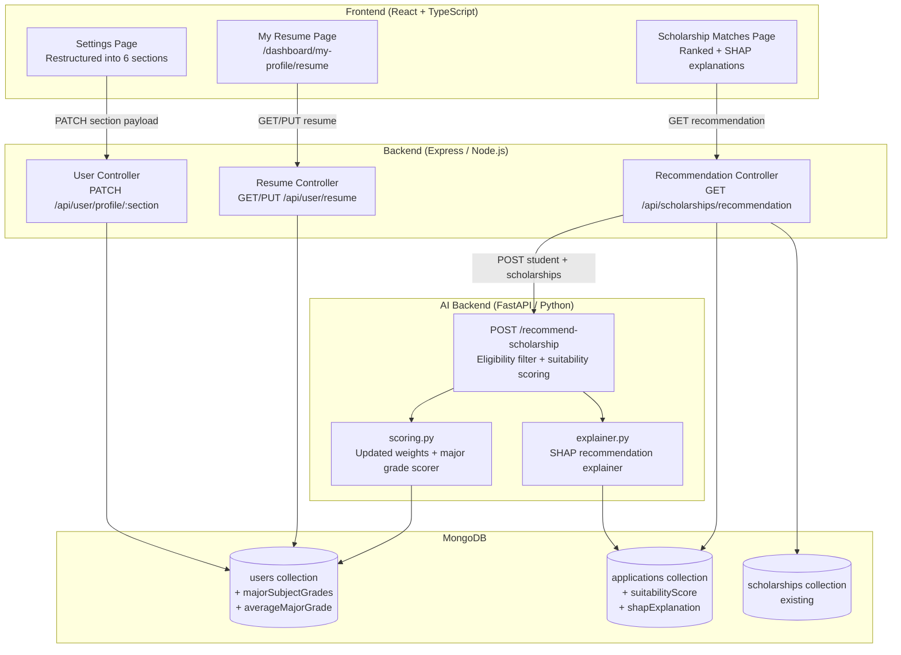
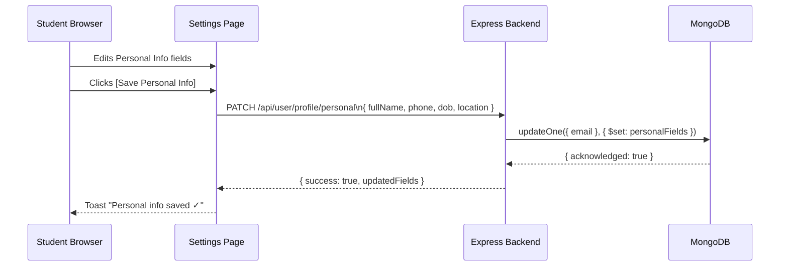
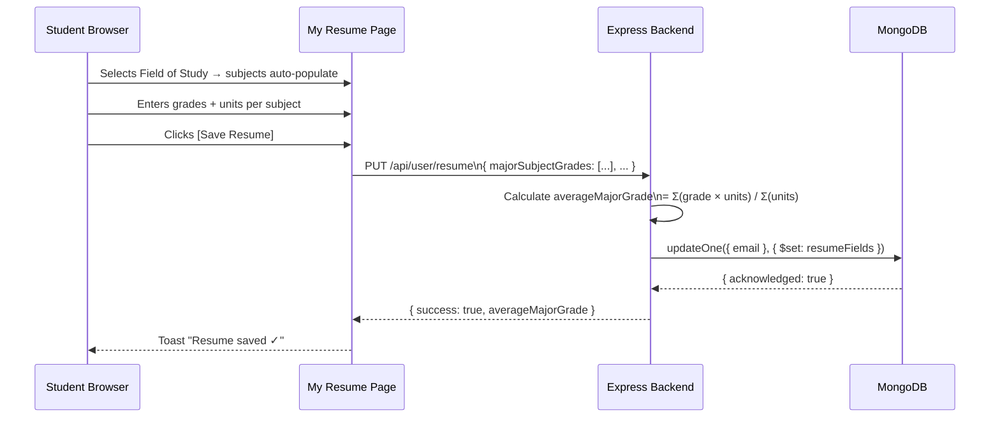
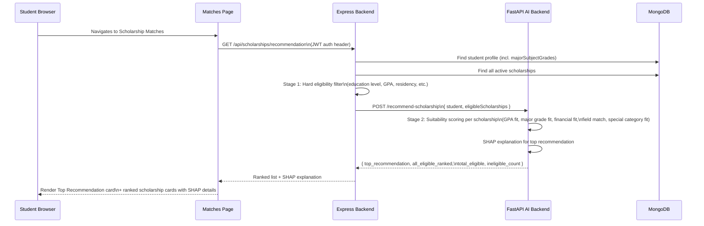

# Design Document: Scholar Profile, Resume & Scholarship Recommendation

## Overview

This feature overhauls the SCHOLAR system's student-facing experience across three interconnected areas: (1) restructuring the Settings page into clearly separated, independently saveable sections; (2) introducing a dedicated **My Resume** page that consolidates academic background, major subject grades, achievements, skills, and documents; and (3) upgrading the AI-powered scholarship recommendation pipeline to incorporate major subject grades into scoring, produce a ranked suitability list per student, and surface rich SHAP-based explanations on the Scholarship Matches page.

The changes span all three tiers of the MERN + FastAPI stack: MongoDB schema additions, new Express API routes, new FastAPI endpoints, and new/refactored React pages and components.

---

## Architecture



---

## Sequence Diagrams

### 1. Student Saves a Settings Section



### 2. Student Saves Major Subject Grades (Resume Page)



### 3. Scholarship Recommendation Flow



---

## Components and Interfaces

### Component 1: Settings Page (Restructured)

**Purpose**: Replace the single monolithic form with six independently saveable section cards.

**Sections**:

| # | Section | Key Fields | Save Action |
|---|---------|-----------|-------------|
| 1 | Personal Information | Profile picture, Full name, Email (read-only), Phone, DOB, Location | PATCH /api/user/profile/personal |
| 2 | Academic Information | Education level, Year level, School name, Campus, School type, School location, Field of study, GPA, Graduation year | PATCH /api/user/profile/academic |
| 3 | Major Subject Grades | Dynamic subject list by field of study, grade + units per subject | Handled by Resume page (link shown) |
| 4 | Financial Information | Currency (PHP), Net worth, Income category, Financial need rating (1–5) | PATCH /api/user/profile/financial |
| 5 | Special Categories | Athlete, Artist, SK Official, Student Leader, Indigent, PWD, Solo Parent checkboxes | PATCH /api/user/profile/special |
| 6 | Account & Security | Change password, 2FA toggle, Email notifications, Privacy, Theme, Language | PATCH /api/user/profile/account |

**Interface**:
```typescript
interface SettingsSectionProps {
  title: string
  description: string
  onSave: (data: Record<string, unknown>) => Promise<void>
  isSaving: boolean
  children: React.ReactNode
}
```

**Responsibilities**:
- Each section is a visually distinct card with its own title, description, and save button
- Show a success toast per section on save
- Sections save independently — no cross-section side effects
- Section 3 (Major Subject Grades) shows a link to the My Resume page instead of inline form

---

### Component 2: My Resume Page

**Route**: `/dashboard/my-profile/resume`

**Purpose**: Dedicated page for the student's academic resume, replacing the resume section previously embedded in Settings.

**Sub-sections**:

| Sub-section | Fields |
|-------------|--------|
| Academic Background | School name, Education level, Year level, Field of study, GPA/GWA, Graduation year |
| Major Subject Grades | Dynamic subject list (see Section 3 spec), grade, grade type, units |
| Achievements & Awards | Academic honors, Sports/arts awards, Leadership positions, Extracurricular activities |
| Skills | Comma-separated skill tags, Technical skills |
| Documents | Uploaded TOR / Form 137, other academic documents |

**Interface**:
```typescript
interface ResumeData {
  academicBackground: AcademicBackground
  majorSubjectGrades: MajorSubjectGrade[]
  achievements: Achievement[]
  skills: string[]
  documents: UploadedDocument[]
}

interface AcademicBackground {
  schoolName: string
  educationLevel: string
  yearLevel: string
  fieldOfStudy: string
  gpa: string
  graduationYear: string
}

interface MajorSubjectGrade {
  subjectName: string
  grade: number
  gradeType: 'philippine' | 'percentage' | 'letter'
  gradeNormalized: number   // always 0–100
  units: number
  fieldOfStudy: string
  semester?: string
  schoolYear?: string
}

interface Achievement {
  category: 'academic' | 'sports' | 'arts' | 'leadership' | 'extracurricular'
  description: string
}

interface UploadedDocument {
  name: string
  url: string
  uploadedAt: string
}
```

**Responsibilities**:
- Dynamically render subject list based on selected field of study
- Support custom subject addition via [+ Add Custom Subject]
- Convert grades between Philippine scale, percentage, and letter grade
- Calculate and display weighted average major grade
- [Save Resume] button at the bottom saves all sub-sections in one request

---

### Component 3: Subject Grade Input

**Purpose**: Reusable form row for entering a single subject's grade.

**Interface**:
```typescript
interface SubjectGradeInputProps {
  subjectName: string
  isCustom: boolean
  grade: string
  gradeType: 'philippine' | 'percentage' | 'letter'
  units: string
  onSubjectNameChange?: (name: string) => void
  onGradeChange: (grade: string) => void
  onGradeTypeChange: (type: string) => void
  onUnitsChange: (units: string) => void
  onRemove?: () => void
}
```

**Responsibilities**:
- Pre-fill subject name for standard subjects; allow editing for custom subjects
- Show grade type dropdown (Philippine Scale | Percentage | Letter Grade)
- Validate grade range based on selected type
- Display normalized equivalent (0–100) as helper text

---

### Component 4: Top Recommendation Card

**Purpose**: Prominently display the AI's top scholarship recommendation with SHAP explanation.

**Interface**:
```typescript
interface TopRecommendationCardProps {
  scholarship: ScholarshipSummary
  suitabilityScore: number
  recommendationLabel: string
  recommendationReason: string
  factorContributions: FactorContribution[]
  onApplyNow: () => void
  onViewDetails: () => void
}

interface FactorContribution {
  factor: string
  shapValue: number
  rawScore: number
  weightPercent: number
  impact: 'positive' | 'negative'
  explanation: string
}
```

**Responsibilities**:
- Show suitability score as a prominent percentage badge
- Display recommendation reason as a plain-English sentence
- Render SHAP factor table with contribution bars
- [Apply Now] and [View Details] action buttons

---

### Component 5: Ranked Scholarship Card

**Purpose**: Card in the ranked list showing rank badge, suitability score bar, and expandable SHAP details.

**Interface**:
```typescript
interface RankedScholarshipCardProps {
  rank: number
  scholarship: ScholarshipSummary
  suitabilityScore: number
  isTopRecommendation: boolean
  topMatchingReasons: string[]
  shapExplanation: ShapExplanation
  onApplyNow: () => void
  onViewFullAnalysis: () => void
}
```

**Responsibilities**:
- Show rank badge (🥇🥈🥉 for top 3, number for rest)
- Render suitability score as a progress bar
- Show top 2 matching reasons as bullet points
- Expandable [View Full Analysis] section with full SHAP factor table

---

## Data Models

### MongoDB: User Schema Additions

```typescript
// Added to existing users collection document
interface UserSchemaAdditions {
  // Major subject grades (new)
  majorSubjectGrades: MajorSubjectGrade[]
  averageMajorGrade: number | null   // weighted average, normalized 0–100

  // Achievements (new)
  achievements: {
    academicHonors: string[]
    sportsArtsAwards: string[]
    leadershipPositions: string[]
    extracurriculars: string[]
  }
}

interface MajorSubjectGrade {
  subjectName: string
  grade: number
  gradeType: 'philippine' | 'percentage' | 'letter'
  gradeNormalized: number   // 0–100 normalized value
  units: number
  fieldOfStudy: string
  semester?: string         // e.g. "1st Semester"
  schoolYear?: string       // e.g. "2023-2024"
}
```

**Validation Rules**:
- `gradeType: 'philippine'` → grade must be 1.00–5.00
- `gradeType: 'percentage'` → grade must be 0–100
- `gradeType: 'letter'` → grade must be one of A, B, C, D, F (converted to normalized value)
- `units` must be a positive integer (1–6)
- `averageMajorGrade` is computed server-side: `Σ(gradeNormalized × units) / Σ(units)`

---

### MongoDB: Application Schema Additions

```typescript
// Added to existing applications collection document
interface ApplicationSchemaAdditions {
  suitabilityScore: number | null       // 0–100, from AI recommendation engine
  scholarshipRank: number | null        // rank among eligible scholarships for this student
  isTopRecommendation: boolean          // true if this is the #1 ranked scholarship
  shapExplanation: ShapExplanation | null
}

interface ShapExplanation {
  recommendationReason: string          // plain-English summary
  factorContributions: FactorContribution[]
  shapSummary: string                   // one-paragraph summary
  vsOtherScholarships: string           // how this compares to other eligible scholarships
}

interface FactorContribution {
  factor: string
  shapValue: number
  rawScore: number
  weightPercent: number
  impact: 'positive' | 'negative'
  level: 'high' | 'medium' | 'low' | 'zero'
  explanation: string
}
```

---

### Grade Conversion Table

| Philippine Scale | Percentage Equivalent | Normalized (0–100) |
|-----------------|----------------------|-------------------|
| 1.00 | 99–100% | 100 |
| 1.25 | 96–98% | 97 |
| 1.50 | 93–95% | 94 |
| 1.75 | 90–92% | 91 |
| 2.00 | 87–89% | 88 |
| 2.25 | 84–86% | 85 |
| 2.50 | 81–83% | 82 |
| 2.75 | 78–80% | 79 |
| 3.00 | 75–77% | 76 |
| 5.00 | below 75% | 0 |

---

### Field of Study → Default Major Subjects Mapping

```typescript
const FIELD_SUBJECTS: Record<string, string[]> = {
  "Computer Science": [
    "Programming", "Data Structures and Algorithms", "Database Management",
    "Computer Networks", "Software Engineering", "Mathematics/Calculus"
  ],
  "Nursing": [
    "Anatomy and Physiology", "Pharmacology", "Medical-Surgical Nursing",
    "Community Health Nursing", "Nursing Research"
  ],
  "Education": [
    "Child Development", "Curriculum Development", "Educational Psychology",
    "Teaching Methods", "Assessment and Evaluation"
  ],
  "Engineering": [
    "Physics", "Engineering Mathematics", "Mechanics",
    "Thermodynamics", "Engineering Drawing"
  ],
  "Business / Accountancy": [
    "Accounting Principles", "Business Finance", "Management",
    "Economics", "Business Law"
  ]
  // All other fields → empty list (custom inputs only)
}
```

---

## API Interfaces

### Express Backend — New / Modified Routes

```typescript
// PATCH /api/user/profile/:section
// section: 'personal' | 'academic' | 'financial' | 'special' | 'account'
interface PatchProfileSectionRequest {
  email: string
  // Fields vary by section — only the section's fields are accepted
}
interface PatchProfileSectionResponse {
  success: boolean
  updatedFields: string[]
}

// GET /api/user/resume
interface GetResumeResponse {
  data: ResumeData
}

// PUT /api/user/resume
interface PutResumeRequest {
  email: string
  academicBackground: AcademicBackground
  majorSubjectGrades: MajorSubjectGrade[]
  achievements: Achievement[]
  skills: string[]
}
interface PutResumeResponse {
  success: boolean
  averageMajorGrade: number
}

// GET /api/scholarships/recommendation  (auth required — JWT)
interface GetRecommendationResponse {
  topRecommendation: {
    scholarship: ScholarshipSummary
    suitabilityScore: number
    recommendationLabel: string
    shapExplanation: ShapExplanation
  }
  allEligibleRanked: RankedScholarship[]
  totalEligible: number
  ineligibleCount: number
}
```

---

### FastAPI AI Backend — New Endpoint

```python
# POST /recommend-scholarship
class RecommendScholarshipRequest(BaseModel):
    student: dict          # full student profile including majorSubjectGrades
    scholarships: list     # pre-filtered eligible scholarships from Express

class SuitabilityResult(BaseModel):
    scholarship_id: str
    scholarship_name: str
    suitability_score: float      # 0–100
    rank: int
    is_top_recommendation: bool
    recommendation_label: str     # "Excellent Match", "Good Match", etc.
    score_breakdown: dict         # per-factor scores
    shap_explanation: dict        # SHAP contributions

class RecommendScholarshipResponse(BaseModel):
    top_recommendation: SuitabilityResult
    all_eligible_ranked: list[SuitabilityResult]
    total_eligible: int
    ineligible_count: int
```

---

### Updated Scoring Weights

**Existing** `score_student()` — weights for ranking applicants per scholarship (unchanged):

| Factor | Weight |
|--------|--------|
| Overall GPA | 25% *(was 30%)* |
| Major Subject Grades | 20% *(new)* |
| Financial Need | 20% *(was 25%)* |
| Document Completeness | 15% *(was 20%)* |
| Document Authenticity | 10% *(was 15%)* |
| Special Category | 10% |

**New** `rank_scholarships_for_student()` — suitability scoring (student → scholarship fit):

| Factor | Weight |
|--------|--------|
| GPA Fit | 25% |
| Major Subject Fit | 20% |
| Financial Fit | 20% |
| Field of Study Match | 20% |
| Special Category Fit | 15% |

---

## Error Handling

### Error Scenario 1: Missing Major Subject Grades

**Condition**: Student has not entered any major subject grades when recommendation is requested.

**Response**: `averageMajorGrade` defaults to `null`; the major subject fit score defaults to 50 (neutral) in the suitability calculation so the student is not penalized.

**Recovery**: Prompt shown on Matches page: "Add your major subject grades to improve recommendation accuracy."

---

### Error Scenario 2: AI Backend Unavailable

**Condition**: Express backend cannot reach FastAPI `/recommend-scholarship` endpoint.

**Response**: Express returns a degraded response using the existing eligibility-filtered list sorted by GPA match only, with `shapExplanation: null`.

**Recovery**: Frontend shows a banner: "AI recommendations are temporarily unavailable. Showing eligibility-based results."

---

### Error Scenario 3: Invalid Grade Input

**Condition**: Student enters a grade outside the valid range for the selected grade type.

**Response**: Client-side validation blocks form submission; inline error message shown per field.

**Recovery**: User corrects the value; no server request is made until validation passes.

---

### Error Scenario 4: Section Save Conflict

**Condition**: Two browser tabs save different sections simultaneously.

**Response**: Each section PATCH uses `$set` on only its own fields — no cross-section overwrite risk. MongoDB's atomic field-level updates prevent data loss.

**Recovery**: Both saves succeed independently.

---

## Testing Strategy

### Unit Testing Approach

- `calculate_major_subject_score()` — test with all grade types, missing grades, zero units
- `rank_scholarships_for_student()` — test ranking stability, tie-breaking, empty scholarship list
- `calculate_field_match()` — test exact match, partial match, no match
- Grade normalization utility — test all Philippine scale values against conversion table
- Settings section save handlers — test that each section only sends its own fields

### Property-Based Testing Approach

**Property Test Library**: `fast-check` (Frontend), `hypothesis` (Python AI Backend)

Key properties to verify:
- For any valid student profile, `averageMajorGrade` is always in [0, 100]
- For any set of eligible scholarships, the ranked list is a permutation of the input (no scholarships added or dropped)
- Suitability scores are always in [0, 100]
- The top recommendation is always the scholarship with the highest suitability score
- Grade normalization is monotonically decreasing on the Philippine scale (1.00 → 100, 5.00 → 0)

### Integration Testing Approach

- End-to-end: Student saves resume → recommendation endpoint returns updated scores reflecting new major grades
- Settings section independence: Saving Section 1 does not overwrite Section 2 fields
- AI backend integration: Express → FastAPI round-trip with a known student profile produces deterministic ranking

---

## Performance Considerations

- The recommendation endpoint fetches all active scholarships and the student profile in parallel (Promise.all) before calling the AI backend.
- The FastAPI `/recommend-scholarship` endpoint processes suitability scoring synchronously; for typical scholarship counts (< 50), latency is expected to be under 200ms.
- Major subject grades are stored as a subdocument array on the user document — no additional collection join needed during scoring.
- SHAP explanation is computed only for the top recommendation on the initial load; full SHAP for other scholarships is computed lazily when the student expands [View Full Analysis].

---

## Security Considerations

- The `GET /api/scholarships/recommendation` endpoint requires a valid JWT — the student can only retrieve their own recommendation.
- The `PUT /api/user/resume` endpoint validates that the authenticated user's email matches the request payload email.
- Grade inputs are validated server-side (range checks, type checks) before being persisted to prevent injection of out-of-range values that could skew scoring.
- Document upload for the Resume page reuses the existing multer configuration with 5MB limit and allowlist of PDF/image MIME types.

---

## Dependencies

| Layer | Dependency | Purpose |
|-------|-----------|---------|
| Frontend | `react-router` (existing) | New `/dashboard/my-profile/resume` route |
| Frontend | `sonner` (existing) | Per-section success toasts |
| Frontend | `lucide-react` (existing) | Icons for rank badges and factor indicators |
| Backend | `express` (existing) | New PATCH section routes, resume routes, recommendation route |
| Backend | `mongoose` (existing) | Schema additions for majorSubjectGrades |
| AI Backend | `shap` (existing) | SHAP explanations for recommendation |
| AI Backend | `scikit-learn` (existing) | GradientBoostingRegressor for SHAP model |
| AI Backend | `fastapi` + `pydantic` (existing) | New `/recommend-scholarship` endpoint |

---

## Correctness Properties

The following properties must hold at all times across the system:

### Property 1: Grade Normalization Bounds

For any grade on the Philippine scale (1.00–5.00), `gradeNormalized` is always in [0, 100]. `gradeNormalized` is monotonically non-increasing as the Philippine scale value increases (1.00 → 100, 5.00 → 0). For any percentage grade (0–100), `gradeNormalized` equals the percentage value directly.

### Property 2: Weighted Average Major Grade Bounds

`averageMajorGrade` is always in [0, 100] for any non-empty set of subject grades with positive units. If all subjects have `gradeNormalized = 100`, then `averageMajorGrade = 100`. If all subjects have `gradeNormalized = 0`, then `averageMajorGrade = 0`. `averageMajorGrade` is null when `majorSubjectGrades` is empty.

### Property 3: Suitability Score Bounds

For any student and any set of eligible scholarships, every suitability score is in [0, 100]. The ranked list returned by `rank_scholarships_for_student()` is always a permutation of the input eligible scholarships — no scholarships are added or removed.

### Property 4: Top Recommendation Uniqueness

The scholarship with `rank = 1` always has the highest or equal suitability score among all ranked scholarships. `isTopRecommendation` is `true` for exactly one scholarship in the ranked list (the one with `rank = 1`).

### Property 5: Settings Section Independence

Saving any one settings section (personal, academic, financial, special, account) must not modify fields belonging to any other section. Each section save is idempotent: saving the same data twice produces the same stored state.

### Property 6: Eligibility Filter Integrity

The recommendation endpoint never returns a scholarship for which the student fails a hard eligibility criterion (education level, minimum GPA, residency). `totalEligible + ineligibleCount` equals the total number of active scholarships at the time of the request.
